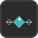

# Animation Recorder

A small dockable PySide6 UI for Maya with three tabs:

- **Animate** — key the selected object's translate or scale, then start
  Play with Record for manual/interactive recording. Includes a
  "Delete All Keys" action for the current selection. Rotate isn't offered
  here — see Notes below.
- **Clean Keys** — thin out or change the tangent interpolation of keyframes
  currently selected in the Graph Editor (per-curve, so it never touches
  attributes you didn't select).
- **Transfer Animation** — copy keyframes from one source object onto one or
  more target objects, matched by shared keyable attributes.



<!-- Add a screenshot of the tool window here once you've grabbed one from Maya, e.g.: -->
<!--  -->

## Requirements

- Autodesk Maya 2025+ (PySide6 / shiboken6 — bundled, no extra install needed)

## Installation

Copy both `animation_recorder_ui.py` and the `icons/` folder into your Maya
`scripts` folder, keeping them side by side:

```
C:/Users/<you>/Documents/maya/<version>/scripts/
├── animation_recorder_ui.py
└── icons/
    └── animation_recorder_icon_*.png
```

The script finds its icon next to itself, so the `icons/` folder has to stay
in the same place — that's also what shows up in the window's title bar.

## Usage

In Maya's Script Editor (Python tab):

```python
import animation_recorder_ui
animation_recorder_ui.show()
```

Re-running `show()` closes and replaces any previously open instance, so it's
safe to re-launch from the shelf without restarting Maya.

### Adding it to a shelf

1. Paste the two lines above into the Script Editor's Python tab.
2. Select them, then middle-mouse-drag the selection onto a shelf — Maya
   creates a new shelf button that runs that command.
3. Right-click the new button → **Edit...**, and under **Icon** browse to
   `icons/animation_recorder_icon_32.png` (32px is the size Maya shelf
   buttons expect; `_64` and `_128` are there for a window icon, a README, or
   a higher-DPI display).

## Notes

- "Animate" uses `cmds.recordAttr` + `cmds.play(record=True)`, which is meant
  for interactive recording while the timeline plays (e.g. manually posing
  the object during playback), not just "set one keyframe on the current
  pose". Keep that in mind if you only want a single key.
- Rotate is deliberately not one of the Animate tab's transformation options.
  Rotation is stored as Euler angles, which aren't a unique representation of
  an orientation — recording it live this way made the manipulator feel
  locked/unusable in practice. If you need to record rotation, do it directly
  in Maya (Channel Box + Play with Record) and clean up the curves afterwards
  with Key > Euler Filter.
- "Transfer Animation" only copies attributes that exist and are keyable on
  both the source and each target object.
